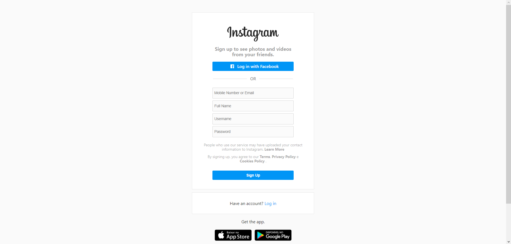

# Sign-up Instagram clone

That project is a sign-up Instagram clone.  
Show it the Instagram form to create an account

Has a simple responsivity using flexbox and media queries.

## Preview image

## Used stacks

, , , 

## Author

Hugo Teixeira da Silva - 8Dev - Djbetamax

 -  - 
